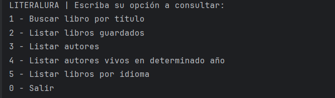
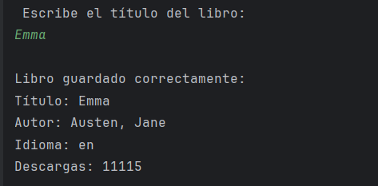
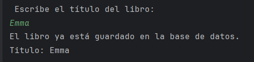
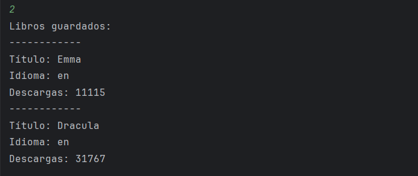
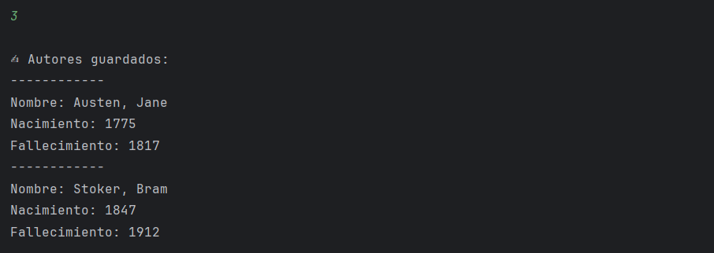
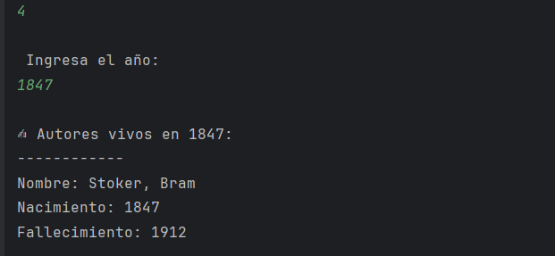
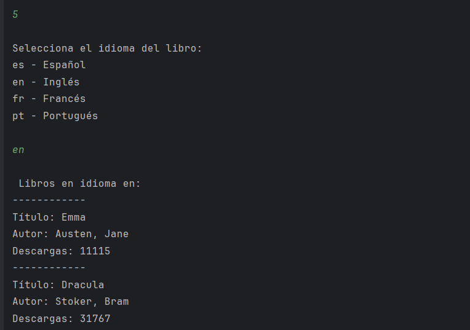

# 📚 LiterAlura

## 📋 Funcionalidades del Sistema
La aplicación LiterAlura permite consultar libros desde la API Gutendex, almacenarlos en una base de datos PostgreSQL y realizar diferentes consultas a través de un menú interactivo en consola.




- ### 🔎 1️⃣ Buscar libro por título
Permite al usuario ingresar el nombre de un libro y realizar una consulta a la API Gutendex.
- Si el libro existe:
- Se muestran sus datos en consola.
- Se guarda en la base de datos.
- Se almacena también su autor (si no existe previamente).



- Se evita duplicar registros.
  


---

- ### 📚 2️⃣ Listar libros registrados
Muestra todos los libros almacenados en la base de datos con su información principal:
- Título
- Idioma
- Número de descargas
  

---

- ### ✍ 3️⃣ Listar autores registrados
Muestra todos los autores guardados en la base de datos junto con:
- Nombre
- Año de nacimiento
- Año de fallecimiento
  

---

- ### 📅 4️⃣ Listar autores vivos en un determinado año
Permite ingresar un año específico y muestra los autores que estaban vivos en esa fecha.

Se considera que un autor estaba vivo si:
- Nació antes o en ese año
- Y no había fallecido aún
  

---

- ### 🌎 5️⃣ Listar libros por idioma
Permite consultar los libros almacenados filtrando por idioma.

Ejemplos de idiomas:
- es → Español
- en → Inglés
- fr → Francés
- pt → Portugués
  

---

## 🧠 Lógica Implementada

✔ Consumo de API externa (Gutendex)

✔ Mapeo de JSON usando record

✔ Persistencia con Spring Data JPA

✔ Relación ManyToOne (Libro → Autor)

✔ Validación para evitar duplicados

✔ Consultas personalizadas con Query Methods

---


## 📂 Estructura del Proyecto

```plaintext
LiterAlura/
│
├── .mvn/                          → Archivos del wrapper de Maven.
│
├── src/
│   ├── main/
│   │   ├── java/com/alura/challenge/katte/demo/
│   │   │
│   │   │   ├── LiteraluraApplication.java
│   │   │   │        → Clase principal que inicia la aplicación
│   │   │   │          y contiene el menú interactivo en consola.
│   │   │   │
│   │   │   ├── model/
│   │   │   │   ├── Libro.java
│   │   │   │   │        → Entidad JPA que representa un libro en la base de datos.
│   │   │   │   │
│   │   │   │   ├── Autor.java
│   │   │   │   │        → Entidad JPA que representa un autor.
│   │   │   │   │
│   │   │   │   ├── DatosLibro.java
│   │   │   │   │        → Record utilizado para mapear la respuesta
│   │   │   │   │          JSON de la API.
│   │   │   │   │
│   │   │   │   ├── DatosAutor.java
│   │   │   │   │        → Record para mapear los datos del autor
│   │   │   │   │          provenientes de la API.
│   │   │   │   │
│   │   │   │   └── DatosRespuesta.java
│   │   │   │            → Record que representa la estructura
│   │   │   │              completa de la respuesta de la API.
│   │   │   │
│   │   │   ├── repository/
│   │   │   │   ├── LibroRepository.java
│   │   │   │   │        → Interfaz JPA para operaciones CRUD de libros.
│   │   │   │   │
│   │   │   │   └── AutorRepository.java
│   │   │   │            → Interfaz JPA para operaciones CRUD de autores.
│   │   │   │
│   │   │   └── service/
│   │   │       └── ConsumoAPI.java
│   │   │            → Clase encargada de realizar la petición HTTP
│   │   │              a la API Gutendex.
│   │   │
│   │   └── resources/
│   │       └── application.properties
│   │            → Configuración de conexión a PostgreSQL
│   │              y propiedades de JPA.
│   │
│   └── test/
│       └── DemoApplicationTests.java
│            → Clase de pruebas generada por Spring Boot.
│
├── pom.xml                          → Archivo de configuración de dependencias Maven.
│
├── mvnw / mvnw.cmd                  → Maven Wrapper.
│
├── .gitignore                       → Archivos excluidos del repositorio.
│
└── README.md                        → Documento descriptivo del proyecto.
````
